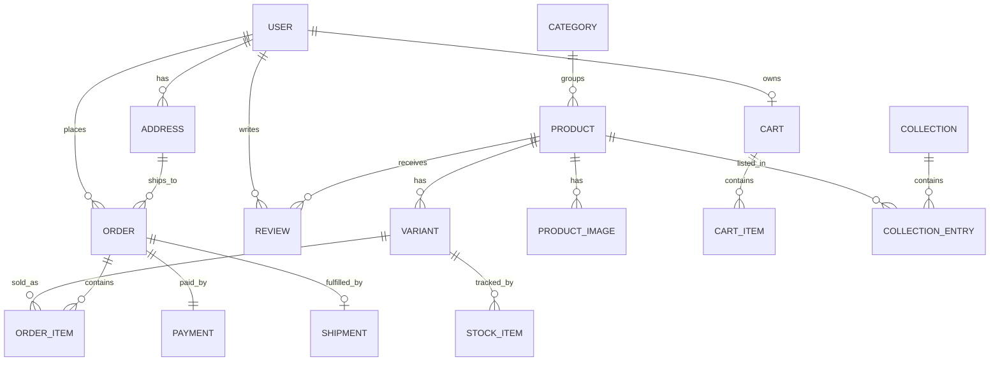
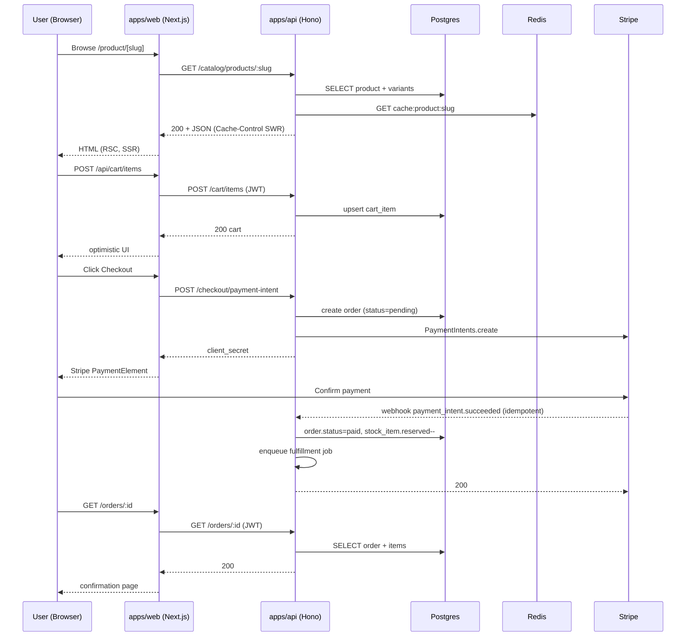

# Architecture — Plateforme E-Commerce

> Spécification d'architecture (HLD + LLD). Cible : plateforme custom, premium, scalable, type-safe end-to-end.

---

## 1. Vue d'ensemble

```
                ┌──────────────────────────────────────────────────────────┐
                │                       Clients                             │
                │   Browser (Next.js) · Mobile (futur) · Admin (futur)     │
                └────────────┬──────────────────────────┬─────────────────┘
                             │ HTTPS                    │ HTTPS
                             ▼                          ▼
              ┌──────────────────────┐     ┌──────────────────────────┐
              │ apps/web (Vercel)    │     │ apps/admin (futur)       │
              │ Next.js 14 App R.    │     │ Next.js 14               │
              │ SSR / ISR / RSC      │     │ Auth.js + RBAC           │
              └──────────┬───────────┘     └────────────┬─────────────┘
                         │ HTTPS + JWT (jose)           │
                         ▼                              ▼
              ┌────────────────────────────────────────────────────────┐
              │             apps/api (Vercel Functions) — Hono                  │
              │   auth-mw · ratelimit · webhook-stripe · observability  │
              │   routes: /catalog · /cart · /orders · /checkout       │
              │           /users · /webhooks/stripe · /admin           │
              │   services · repositories · jobs                       │
              └─────┬──────────────────────────┬───────────────────┬───┘
                    ▼                          ▼                   ▼
        ┌────────────────────┐    ┌─────────────────────┐  ┌────────────┐
        │ Postgres (Neon)    │    │ Upstash Redis       │  │ R2 (S3)    │
        └────────────────────┘    └─────────────────────┘  └────────────┘
                                        │
                                        ▼
                              ┌─────────────────────┐
                              │ Stripe (live+mock)  │
                              └─────────────────────┘
```

Trois déploiements indépendants : web, api, worker (jobs). Un store objets commun (R2) pour les assets ; un cache Redis pour sessions / cache / rate-limit.

---

## 2. Découpage domaine (bounded contexts)

```
catalog  ←→  cart  ←→  checkout  ←→  order  ←→  fulfillment
   │                            │
   └────→  user/identity  ←────┘
              │
              └────→  notification (email, push)
```

- catalog : produits, variantes, catégories, attributs, images, stock.
- cart : panier anonyme (cookie signé + Redis) et panier utilisateur (DB).
- checkout : adresse, livraison, paiement Stripe ; crée l'order au succès du payment_intent.
- order : commandes, statuts, factures, historique.
- user/identity : comptes, adresses, rôles.
- notification : emails transactionnels (Resend + React Email).

Chaque contexte ⇒ un dossier dans apps/api/src/services/<context>/ avec son repo Drizzle et ses tests.

---

## 3. Topologie du monorepo

```
ecommerce/
├── apps/
│   ├── web/                # Next.js 14 storefront
│   └── api/                # Hono backend
├── packages/
│   ├── db/                 # Schéma Drizzle + migrations + client
│   ├── shared/             # Schémas Zod + types exportés FE/BE
│   ├── ui/                 # Design system maison (Tailwind + primitives)
│   ├── eslint-config/      # Configs partagées
│   └── tsconfig/           # tsconfig.base.json
├── specs/                  # ARCHITECTURE.md, TECH_STACK.md, ADR/, RFC/
├── tooling/                # Scripts CI, générateurs, configs
├── pnpm-workspace.yaml
├── turbo.json
├── package.json
├── .env.example
├── .nvmrc
├── .editorconfig
├── .prettierrc
└── README.md
```

Règles :

- apps/* peuvent dépendre de packages/*, jamais entre elles directement.
- packages/ui ne dépend que de clsx, cva, lucide-react, tailwindcss, tailwind-merge.
- packages/shared ne dépend de rien (Zod + types seulement).
- Imports cross-app interdits ; si besoin d'une fonction partagée → elle va dans packages/shared.

---

## 4. Modèle de données (haut niveau)



### Tables clés (extrait de schéma Drizzle)

- user(id, email, name, password_hash, role, created_at)
- address(id, user_id, line1, line2, city, postal_code, country, phone, is_default)
- category(id, parent_id, slug, name, description)
- product(id, slug, title, description, brand, status, default_category_id, created_at)
- variant(id, product_id, sku, price_cents, currency, weight_g)        # attributs : voir §4.4 (D-12 : table typés + JSONB metadata)
- product_image(id, product_id, url, alt, position)
- stock_item(variant_id PK, on_hand, reserved, updated_at)
- cart(id, user_id NULL, anonymous_token NULL, created_at, updated_at)
- cart_item(id, cart_id, variant_id, qty, unit_price_cents)
- order(id, user_id, number, status, total_cents, currency, address_id, created_at)
- order_item(id, order_id, variant_id, qty, unit_price_cents, line_total_cents)
- payment(id, order_id, provider, intent_id, status, amount_cents, raw jsonb)
- shipment(id, order_id, carrier, tracking, status)
- review(id, product_id, user_id, rating, title, body, created_at)
- webhook_event(id, provider, event_id UNIQUE, type, payload jsonb, received_at, processed_at)
- product_attribute(id, product_id, name, value, position)          # typé (cf. D-12)
- product_attribute_def(id, name, value_type, filterable, public)   # typologie des attributs (admin)
- variant_metadata(variant_id, metadata jsonb)                       # ex: story, materials, care (cf. D-12)
- collection(id, slug, title, type)
- collection_entry(collection_id, product_id, position)

Notes :

- Pas de soft delete global ; flag status ou table d'archive selon la table.
- Toutes les tables ont created_at / updated_at.
- Devises manipulées en cents (int) pour éviter les erreurs d'arrondi.
- webhook_event.event_id UNIQUE ⇒ idempotence naturelle pour Stripe.

### Index plan (extrait)

- product(slug UNIQUE, status)
- product(status, created_at DESC)
- variant(product_id, sku UNIQUE)
- order(user_id, created_at DESC)
- order(status, created_at DESC)
- order_item(order_id)
- review(product_id, created_at DESC)
- stock_item(variant_id) PRIMARY KEY
- tsvector colonne GENERATED sur product(title, description, brand) + GIN
---

### 4.4. Attributs produit — D-12 (mix table typés + JSONB metadata)

Deux représentations cohabitent, par besoin :

| Besoin | Table | Pourquoi |
|---|---|---|
| **Filtrage facetté** (taille, couleur, matière, contenance) | `product_attribute` (rows typés) + `product_attribute_def` (dictionnaire) | Indexable, requêtable, type-safe |
| **Storytelling & SEO** (histoire maker, matériaux, entretien, anecdotes) | `variant_metadata` (JSONB) | Flexible, pas de migration à chaque ajout, non filtré |

**Règles :**
- Tout attribut `filterable=true` dans `product_attribute_def` **doit** avoir au moins une row dans `product_attribute` par produit.
- Les attributs de type `story / metadata` vont dans `variant_metadata` (jamais filtrés).
- Migration future : si une `metadata` devient `filterable`, on l'extrait en row typée (one-shot script).

Justification : compromis entre structure (filtres, SEO, agrégations) et flexibilité (story maker itère vite sans migration). Cf. ADR à venir si complexité.

### 4.5. Modèle d'erreur (RFC 7807)

Toutes les réponses 4xx/5xx de l'API sont conformes **RFC 7807 (Problem Details for HTTP APIs)**.

**Header :** `Content-Type: application/problem+json`

**Body :**
```json
{
  "type": "https://errors.shop.com/cart/empty",
  "title": "Cart is empty",
  "status": 409,
  "detail": "Votre panier a été vidé.",
  "instance": "/v1/checkout/confirm",
  "code": "cart_empty",
  "traceId": "aG93LXNvbWUtdHJhY2U"
}
```

- Membres standards : `type` (URI), `title`, `status`, `detail`, `instance` (chemin de la requête).
- Membres d'extension : `code` (catalogue fermé, 27 valeurs), `traceId`, `issues`, `field`, `help`.
- Source unique : `packages/shared/src/schemas/problem.ts` (Zod + types + catalogue `ERROR_CODES`).
- Helper côté route : `throw problemThrow('cart_empty', { detail: '…' })`.
- Côté front : `parseProblemResponse(json)` (Zod strict) ⇒ typage end-to-end.

Détails dans [ADR 0002](./adr/0002-rfc7807-error-contract.md).

## 5. Cycle d'une commande (séquence)



Idempotence :

- Webhook : webhook_event(event_id UNIQUE) ⇒ rejouable sans doublon.
- Soumission checkout : clé Idempotency-Key côté Stripe + garde côté DB sur (user_id, cart_id).

---

## 6. API design

### 6.1 Conventions REST

- Préfixe /v1.
- Ressources au pluriel : /products, /orders, /carts.
- Versioning : header + URL.
- Pagination : ?limit= + ?cursor= (cursor-based, pas offset ; cohérence avec les gros catalogues).
- Filtres : query params validés par Zod (un schéma par endpoint).
- Erreurs uniformes (RFC 7807-like) :

```json
{
  "type": "https://errors.shop.com/order/not-found",
  "title": "Order not found",
  "status": 404,
  "code": "order_not_found",
  "detail": "No order with id=ord_123 for the current user.",
  "traceId": "01HZ..."
}
```

### 6.2 Routes principales (v1)

```
GET    /v1/catalog/products                # liste paginée + filtres
GET    /v1/catalog/products/:slug          # détail (cache SWR)
GET    /v1/catalog/categories
POST   /v1/cart                            # crée un panier
GET    /v1/cart                            # courant (anon ou user)
POST   /v1/cart/items                      # { variantId, qty }
PATCH  /v1/cart/items/:id
DELETE /v1/cart/items/:id
DELETE /v1/cart

POST   /v1/checkout/payment-intent         # crée order + PI Stripe
POST   /v1/webhooks/stripe                 # webhook signé

GET    /v1/orders                          # historique user
GET    /v1/orders/:number
POST   /v1/orders/:number/cancel           # avant fulfillment

GET    /v1/users/me
PATCH  /v1/users/me
GET    /v1/users/me/addresses
POST   /v1/users/me/addresses
PATCH  /v1/users/me/addresses/:id
DELETE /v1/users/me/addresses/:id

POST   /v1/uploads/sign                    # URL signée R2 pour upload direct

# Admin (auth + role=admin)
GET    /v1/admin/products
POST   /v1/admin/products
PATCH  /v1/admin/products/:id
...
```

### 6.3 Auth API (Edge-compatible)

- Cookie __Host-session : HttpOnly, Secure, SameSite=Lax, signé JWE via jose.
- Émis par le web après login Auth.js.
- Vérifiés par verifyJwt middleware Hono.
- Pas de cookie sur les endpoints publics ; JWT Bearer pour les usages serveur-à-serveur (webhooks sortants futurs, apps mobile).

### 6.4 OpenAPI

- Généré automatiquement par @hono/zod-openapi à partir des routes + schémas Zod.
- Servi à /v1/docs (Swagger UI) et /v1/openapi.json (machine-readable).
- Source unique = packages/shared/src/schemas/*, importés par le web ET l'API. Pas de duplication.

---

## 7. Frontend — apps/web

```
apps/web/
├─ app/
│  ├─ layout.tsx                       # RootLayout, polices, theme
│  ├─ page.tsx                         # Landing
│  ├─ (storefront)/
│  │  ├─ catalog/
│  │  │  ├─ page.tsx                   # Listing
│  │  │  └─ [slug]/page.tsx            # Fiche produit (ISR)
│  │  ├─ cart/page.tsx
│  │  ├─ checkout/
│  │  │  ├─ page.tsx
│  │  │  └─ success/page.tsx
│  │  └─ orders/(account)/...
│  ├─ (auth)/sign-in/page.tsx
│  ├─ api/                             # Route Handlers (BFF si besoin)
│  ├─ globals.css                      # Tailwind layers + tokens CSS
│  └─ not-found.tsx
├─ components/                         # Composants métier (par domaine)
├─ lib/
│  ├─ api/                             # fetchers typés, TanStack Query hooks
│  ├─ auth/                            # helpers Auth.js
│  └─ utils/
├─ styles/
│  └─ tokens.css                       # Variables CSS (couleurs, espacements)
├─ public/
└─ middleware.ts                       # redirects, sécurité, A/B
```

### SSR / cache par route

| Route | Stratégie | Revalidation |
|---|---|---|
| / (landing) | SSG + ISR | 60 s |
| /catalog (listing) | SSR + Cache-Control s-maxage=60 SWR=300 | 60 s |
| /catalog/[slug] (fiche) | SSG + ISR + tag invalidation | 5 min |
| /cart | SSR no-cache (auth) | — |
| /checkout | SSR no-cache (auth) | — |
| /account | SSR no-cache (auth) | — |
| /admin/* | SSR no-cache (auth admin) | — |

On utilise revalidateTag('product:'+id) après une mise à jour admin pour purger le cache web ET l'API (le middleware API réécrit le header via Cache-Tag).

### RSC vs Client

- Server Component par défaut : layouts, pages, listes, fiches produit, headers/footers.
- Client Component : composants interactifs (filters, cart, checkout form, admin forms).
- Server Actions : uniquement pour les mutations cross-domain (newsletter signup, contact). Pas pour le checkout → tout passe par l'API (webhooks Stripe, idempotence, audit).

### Sécurité frontend

- Content-Security-Policy strict ; nonce sur scripts RSC.
- Headers via next.config.mjs : HSTS, X-Frame-Options, Permissions-Policy, Referrer-Policy.
- Rate-limit du /api/cart/* et /api/checkout/* via le middleware API (Upstash Ratelimit).

---

## 8. Backend — apps/api

```
apps/api/
├─ src/
│  ├─ server.ts                        # bootstrap Hono + @hono/node-server
│  ├─ app.ts                           # factory createApp() (testable)
│  ├─ routes/
│  │  ├─ catalog/
│  │  ├─ cart/
│  │  ├─ checkout/
│  │  ├─ orders/
│  │  ├─ users/
│  │  ├─ uploads/
│  │  └─ webhooks/stripe.ts
│  ├─ services/                        # métier (pur, testable)
│  │  ├─ catalog/
│  │  ├─ cart/
│  │  ├─ checkout/
│  │  ├─ orders/
│  │  └─ notification/
│  ├─ repositories/                    # accès DB (Drizzle)
│  ├─ middleware/
│  │  ├─ auth.ts
│  │  ├─ ratelimit.ts
│  │  ├─ request-id.ts
│  │  └─ errors.ts
│  ├─ lib/
│  │  ├─ db.ts                         # client Drizzle (pool)
│  │  ├─ redis.ts
│  │  ├─ stripe.ts                     # client + mock toggle
│  │  └─ logger.ts
│  └─ jobs/                            # cron + queues (BullMQ/Upstash Q)
└─ test/                               # Vitest setup + tests integration
```

### Patterns

- app.ts exporte createApp(deps) pour injecter services dans les tests.
- Erreurs typées (OrderNotFoundError, etc.), mappées par le middleware errors.ts → réponse uniforme.
- Logger enrichi du requestId à chaque handler.
- Validation en entrée via @hono/zod-validator(target, schema) ; tout le reste du code manipule des valeurs typées.
- Idempotence sur les mutations sensibles via table dédiée ou header Stripe.

### Stripe mock (dev)

```
if (env.PAYMENTS_MODE === 'mock') {
  return {
    intent: () => ({ id: 'pi_mock_'+nanoid(), client_secret: 'cs_mock_...' }),
    confirmFake: () => ({ status: 'succeeded' })
  }
}
```

Permet de tester le tunnel complet sans clé Stripe ni carte. En CI, PAYMENTS_MODE=mock est l'option par défaut.

---

## 9. Données — packages/db

- Drizzle = SQL-first ; pas de logique métier ici.
- Schémas regroupés dans src/schema/<context>.ts ; index.ts ré-exporte tout.
- Migrations versionnées, générées via drizzle-kit generate, appliquées via drizzle-kit migrate ou step CI.
- Connexion pool postgres (porsager) ; transactions sur checkout/order.
- Lecture : fonctions pures repo.findById/repo.list ; écriture : repo.upsert typés.
---

## 10. Sécurité (OWASP Top 10)

| Risque | Mitigation |
|---|---|
| A01 Broken Access Control | Middleware auth + RBAC par rôle ; vérification systématique user_id vs ressource ; ownership check dans chaque service. |
| A02 Cryptographic Failures | Secrets via Doppler ; TLS partout ; mots de passe argon2id ; chiffrement at-rest activé Neon ; JWT JWE (jose). |
| A03 Injection | Zod valide toute entrée ; Drizzle = requêtes paramétrées ; jamais de string interpolation SQL. |
| A04 Insecure Design | Threat modeling par epic ; ADR pour chaque feature sensible ; idempotence sur les paiements. |
| A05 Security Misconfiguration | Headers OWASP via middleware ; CSP strict ; secrets jamais en repo ; pre-commit gitleaks. |
| A06 Vulnerable Components | Renovate / Dependabot, audit pnpm weekly, lockfile commited. |
| A07 Auth Failures | Argon2id, lockout progressif, MFA ready (TOTP), session DB révocable. |
| A08 Data Integrity Failures | Webhooks Stripe signés + table webhook_event UNIQUE ; Idempotency-Key sur mutations. |
| A09 Logging Failures | pino JSON partout ; Sentry en prod ; alertes SRE sur taux d'erreurs. |
| A10 SSRF | Sorties HTTP allowlistées pour imports/scraping ; aucune URL user-controlled fetchée côté serveur sans validation. |

### RGPD

- Pas de tracking tiers sans consentement (cookie banner).
- Endpoint /v1/users/me/export (données perso, JSON) et /v1/users/me (suppression compte → anonymisation).
- Hébergement UE (Neon EU / Vercel EU).
- DPA avec tous les sous-traitants (Stripe, Resend, R2, Sentry, Vercel, Cloudflare).

---

## 11. Performance budget

| Métrique (web) | Cible |
|---|---|
| LCP | < 2.0 s (p75 mobile 4G) |
| INP | < 200 ms |
| CLS | < 0.1 |
| TTFB origin | < 200 ms |
| JS shipped (page produit) | < 100 KB gzip |
| LCP image (webp/avif) | < 80 KB |

Leviers :

- RSC + streaming.
- next/image AVIF, sizes responsive, priority sur le hero.
- Prefetch des liens produit.
- CSS critique inliné, Tailwind JIT.
- Cache SWR sur le listing.
- Bundle analyzer en CI (alert si +5 % taille).

---

## 12. Observabilité

| Signal | Outil | Destination |
|---|---|---|
| Logs | pino (JSON) | Better Stack / Logtail |
| Errors | Sentry | Sentry |
| RUM (web) | Sentry Browser + Vercel Analytics | Sentry / Vercel |
| Traces | OpenTelemetry SDK (rollout progressif) | Honeycomb / Tempo |
| Métriques | prom-client exposé sur /metrics | scrapé par Uptime / Grafana Cloud |
| Synthetic uptime | Better Stack / Checkly | alerte Slack si > 99 % |

Chaque handler API génère un span ; chaque action admin trace la durée et le résultat. Corrélation via X-Request-Id propagé web ⇄ API.

---

## 13. Déploiement & CI/CD

### Pipelines GitHub Actions

```
.github/workflows/
├─ ci.yml        # lint, typecheck, test, build — sur tout PR
├─ api-deploy.yml# Vercel Functions (preview par PR)
├─ web-deploy.yml# Vercel (preview par PR, prod sur main)
├─ db-migrate.yml# drizzle-kit migrate sur Neon (preview + main)
└─ release.yml   # changesets version + publish packages/* si publics
```

### Environnements

- dev (local docker-compose / Neon branch).
- preview (par PR : Vercel preview + API preview URL + Neon branch).
- staging (branche release/*).
- prod (main, gated par 2 reviewers).

### Stratégie de release

- Trunk-based, release branches hebdomadaire.
- Feature flags (PostHog ou Vercel Edge Config) pour activer progressivement.
- DB : expansion/collapse sur les migrations critiques ; pas de drop column pendant 1 release.

---

## 14. Risques techniques et dette anticipée

| Risque | Probabilité | Impact | Mitigation |
|---|---|---|---|
| Verrouillage Stripe | Moyen | Élevé | Adapter d'abstraction Provider ; fallback Adyen (v2) |
| Couplage fort checkout/orders | Moyen | Moyen | Découper en services indépendants + messages (Outbox pattern) |
| Fuite perf images | Moyen | Moyen | Loader R2 custom + budget taille en CI |
| Dérive DS (composants ad hoc) | Élevée | Moyen | Visual regression + revue DS obligatoire pour tout composant nouveau dans apps/* |
| Croissance catalogue → Postgres FTS insuffisant | Faible (v1) | Moyen | Tolérance 0 ⇒ bascule Meilisearch sans réécriture (lib Repository abstraite) |
| Drift RGPD entre pays | Moyen | Élevé | Module consent / cookie banner dès v1 ; audit DPA tous les 12 mois |

---

## 15. Roadmap technique (indicative)

### v1 — Storefront MVP (8-10 semaines)

1. Monorepo + tooling (1 sem)
2. Auth (Auth.js + Drizzle adapter) + users (1 sem)
3. Catalogue + listing + fiche (1.5 sem)
4. Panier (anon + user) (1 sem)
5. Checkout Stripe (Payment Element) + webhooks (2 sem)
6. Orders & emails (1 sem)
7. DS + UI premium (parallèle, 2.5 sem)
8. Tests e2e critiques (1 sem)
9. Hardening (rate-limit, CSP, Sentry) (0.5 sem)
10. Lighthouse / perf budget (0.5 sem)

### v2 — Scale

- Admin custom (CRUD produit, stock, orders)
- Recherche Meilisearch
- Wishlist, recommandations (pgvector ou external)
- Multi-devise / multi-langue (next-intl)
- Worker file (BullMQ + Upstash Redis) pour fulfillment/inventory
- App mobile (React Native + Tamagui), réutilise packages/shared et OpenAPI

### v3 — Advanced

- Click & collect
- Programme fidélité
- A/B testing
- Marketplace (multi-vendor)

---

## 16. Annexes

### 16.1 Glossaire

- DC : Drizzle (ORM)
- DS : design system
- ISR : Incremental Static Regeneration (Next.js)
- JWE : JSON Web Encryption
- PI : PaymentIntent (Stripe)
- RSC : React Server Component
- SWR : stale-while-revalidate

### 16.2 ADR

Voir specs/adr/0001-monorepo-pnpm.md et suivants. Chaque décision lourde (changement de stack, de pattern) ⇒ ADR de 15 lignes max : contexte, décision, conséquences.

### 16.3 Sécurité opérationnelle — checklist go-live

- Auth.js production secret rotaté, AUTH_SECRET en Doppler
- Stripe live keys, webhook secret en env, replay testé
- CSP sans unsafe-inline (vérifier nonce), HSTS activé
- Sentry sourcemaps upload CI
- Pino redacteur active (Authorization, Cookie, Set-Cookie)
- Neon : pool sizing ajusté, branching désactivé pour prod
- Backups DB Neon : PITR configuré, restauration testée
- DNS CAA + DNSSEC activés
- Status page + on-call SRE défini
- Penetration test externe sur les flows checkout + auth
